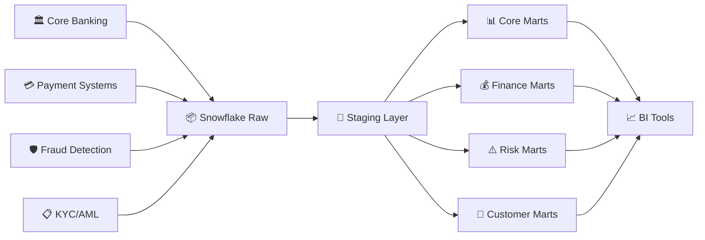

# 🏦 cap111 UK Banking Analytics - dbt ELT Pipeline

[](https://www.getdbt.com/)
[](https://www.snowflake.com/)
[](https://github.com)

> A production-ready ELT pipeline built with dbt (Data Build Tool) that transforms raw banking data into analytics-ready datasets within Snowflake for cap111 UK.

## 🎯 Project Overview

This comprehensive data pipeline processes and transforms data from multiple banking systems to create actionable business insights:

| **Data Source** | **Description** | **Models** |
|-----------------|-----------------|------------|
| 🏛️ Core Banking | Customer accounts and profiles | `stg_customers`, `stg_accounts` |
| 💳 Payments | Transaction processing data | `stg_transactions` |
| 💰 Credit | Loans and credit products | `stg_credit_loans` |
| 🛡️ Fraud Detection | Alert and investigation data | `stg_fraud_alerts` |
| 📋 Compliance | KYC/AML regulatory data | `stg_kyc_aml` |

## 🏗️ Architecture & Data Flow



### 📋 Data Processing Steps

1. **🔄 Extract & Load**: Raw data from banking systems → Snowflake
2. **🧹 Staging**: Data cleaning, validation, and standardization
3. **🏭 Transformation**: Business logic and metric calculations
4. **📊 Analytics**: Ready-to-use datasets for reporting

## 📁 Project Structure

```
snowflake-db2-impl/
├── 🔧 Configuration Files
│   ├── dbt_project.yml          # Main dbt project config
│   ├── profiles.yml             # Snowflake connection
│   ├── packages.yml             # dbt dependencies
│   └── requirements.txt         # Python dependencies
│
├── 📊 Data Models
│   ├── staging/                 # 🧹 Data Cleaning Layer
│   │   ├── sources.yml          # Source definitions
│   │   ├── stg_customers.sql    # Customer data cleaning
│   │   ├── stg_accounts.sql     # Account information
│   │   ├── stg_transactions.sql # Transaction processing
│   │   ├── stg_credit_loans.sql # Credit products
│   │   ├── stg_fraud_alerts.sql # Fraud detection
│   │   └── stg_kyc_aml.sql      # Compliance data
│   │
│   └── marts/                   # 🏭 Business Logic Layer
│       ├── core/                # Core entities
│       │   ├── dim_customers.sql     # Customer 360 view
│       │   └── fct_transactions.sql  # Transaction facts
│       ├── finance/             # Financial analytics
│       │   └── financial_kpis.sql    # Key metrics
│       ├── risk/                # Risk management
│       │   └── customer_risk_profile.sql
│       └── customer/            # Customer insights
│           └── customer_analytics.sql
│
├── 🔧 Utilities
│   ├── macros/                  # Reusable SQL functions
│   ├── snapshots/               # Historical data tracking
│   └── tests/                   # Data quality tests
│
└── 🚀 Automation
    ├── run_pipeline.ps1         # Pipeline orchestration
    └── .sqlfluff                # SQL linting rules
```

## ✨ Key Features

<table>
<tr>
<td width="50%">

### 👥 Customer 360 View
- 🔍 Comprehensive customer profiling
- 🎯 Segmentation (Premium, Affluent, Mass Market)
- 👨‍👩‍👧‍👦 Generational analysis
- ⚠️ Risk profiling & scoring

### 💳 Transaction Analytics
- ⚡ Real-time incremental processing
- 🏷️ Automated spending categorization
- 🔍 Behavioral pattern analysis
- 🛡️ Fraud detection integration

</td>
<td width="50%">

### ⚠️ Risk Management
- 📊 Credit risk scoring algorithms
- 📈 Portfolio health monitoring
- 🚨 NPL (Non-Performing Loan) tracking
- 📋 Regulatory compliance reporting

### 💰 Financial KPIs
- 📊 Balance sheet optimization
- 🎯 Asset quality indicators
- 💹 Profitability analysis
- 📈 Performance benchmarking

</td>
</tr>
<tr>
<td colspan="2">

### 📊 Customer Analytics Dashboard
- 🎯 **Engagement Scoring**: Customer activity and interaction metrics
- 📱 **Channel Preferences**: Mobile, online, branch usage patterns
- 🛒 **Cross-sell Opportunities**: Product recommendation engine
- 🔄 **Lifecycle Management**: Customer journey stage tracking

</td>
</tr>
</table>

## 🚀 Quick Start Guide

### 📋 Prerequisites

| Requirement | Version | Purpose |
|-------------|---------|---------|
|  | Latest | Data warehouse platform |
|  | 3.8+ | dbt runtime environment |
|  | 1.5+ | Data transformation tool |

### 🛠️ Installation & Setup

<details>
<summary><b>🔽 Step 1: Environment Setup</b></summary>

```bash
# 📥 Clone the repository
git clone https://github.com/venkatavvari3/snowflake-db2-impl.git
cd snowflake-db2-impl

# 🐍 Create Python virtual environment
python -m venv venv

# 🚀 Activate virtual environment
# Windows:
venv\Scripts\activate
# macOS/Linux:
source venv/bin/activate

# 📦 Install dependencies
pip install -r requirements.txt

# 🔌 Install dbt packages
dbt deps
```
</details>

<details>
<summary><b>🔽 Step 2: Snowflake Configuration</b></summary>

```bash
# 📄 Copy environment template
cp .env.example .env

# ✏️ Edit .env with your Snowflake credentials
SNOWFLAKE_ACCOUNT=your-account.region.snowflakecomputing.com
SNOWFLAKE_USER=your-username
SNOWFLAKE_PASSWORD=your-password
SNOWFLAKE_ROLE=TRANSFORMER
SNOWFLAKE_DATABASE=cap111_ANALYTICS
SNOWFLAKE_WAREHOUSE=ANALYTICS_WH
```
</details>

<details>
<summary><b>🔽 Step 3: Test & Run</b></summary>

```bash
# 🔍 Test connection
dbt debug

# 🚀 Run the complete pipeline
.\run_pipeline.ps1 -Target dev

# 📊 Generate documentation
dbt docs generate
dbt docs serve
```
</details>

## 📊 Data Models Overview

### 🧹 Staging Models (Data Cleaning Layer)

| Model | Purpose | Key Features |
|-------|---------|--------------|
| `stg_customers` | Customer master data | PII masking, data validation, standardization |
| `stg_accounts` | Account information | Balance calculations, account categorization |
| `stg_transactions` | Transaction processing | Categorization, fraud flags, incremental loading |
| `stg_credit_loans` | Credit products | Risk metrics, payment status, utilization |
| `stg_fraud_alerts` | Fraud detection | Investigation workflow, risk scoring |
| `stg_kyc_aml` | Compliance data | Regulatory status, risk assessment |

### 🏭 Core Business Models

| Model | Type | Description |
|-------|------|-------------|
| `dim_customers` | Dimension | 360-degree customer view with segmentation |
| `fct_transactions` | Fact | Transaction analytics with behavioral insights |

### 📈 Specialized Analytics Models

<table>
<tr>
<td width="33%">

#### 💰 **Finance Marts**
- `financial_kpis`
  - Balance sheet metrics
  - NPL ratios
  - Profitability indicators
  - Regulatory ratios

</td>
<td width="33%">

#### ⚠️ **Risk Marts**
- `customer_risk_profile`
  - Credit risk scoring
  - Delinquency tracking
  - Portfolio analysis
  - Early warning systems

</td>
<td width="33%">

#### 👥 **Customer Marts**
- `customer_analytics`
  - Engagement scoring
  - Channel preferences
  - Cross-sell opportunities
  - Lifecycle analysis

</td>
</tr>
</table>

## 🎯 Business Use Cases & Applications

<table>
<tr>
<td width="50%">

### ⚠️ **Risk Management**
- 📊 **Portfolio Health Monitoring**
  - Real-time credit risk assessment
  - Early warning system for defaults
  - Regulatory capital calculations
- 🎯 **Customer Risk Profiling**
  - Dynamic risk scoring algorithms
  - Delinquency trend analysis
  - Stress testing scenarios

### 👥 **Customer Management**
- 🎯 **Segmentation & Targeting**
  - Behavioral-based customer segments
  - Lifetime value analysis
  - Retention strategy optimization
- 🛒 **Cross-sell & Upsell**
  - Product recommendation engine
  - Opportunity identification
  - Campaign effectiveness tracking

</td>
<td width="50%">

### 💰 **Financial Analysis**
- 📈 **Performance Metrics**
  - Balance sheet optimization
  - Profitability by customer segment
  - Operational efficiency indicators
- 📋 **Regulatory Reporting**
  - Automated compliance reports
  - Audit trail maintenance
  - Risk-weighted asset calculations

### 🛡️ **Fraud Prevention**
- 🚨 **Real-time Monitoring**
  - Transaction anomaly detection
  - Suspicious pattern identification
  - Investigation workflow automation
- 🔍 **Investigation Support**
  - Alert prioritization
  - False positive reduction
  - Case management integration

</td>
</tr>
</table>

## 🔒 Security, Compliance & Quality

<table>
<tr>
<td width="33%">

### 🛡️ **Security Features**
- 🔐 PII data masking
- 🚪 Row-level security ready
- 🔑 Role-based access control
- 📝 Comprehensive audit trails

</td>
<td width="33%">

### 📋 **Compliance Ready**
- ✅ GDPR compliance framework
- 🏛️ Banking regulation support
- 📊 Automated regulatory reporting
- 🔍 KYC/AML monitoring

</td>
<td width="33%">

### ✅ **Data Quality**
- 🎯 Automated testing suite
- 🔗 Referential integrity checks
- 📊 Business rule validation
- ⏰ Data freshness monitoring

</td>
</tr>
</table>

### 📊 **Quality Assurance Framework**

```bash
# 🧪 Run comprehensive tests
dbt test

# 📈 Generate quality reports
dbt docs generate

# 🔍 Validate data lineage
dbt docs serve
```

## 🚀 Pipeline Operations & Deployment

### 🔄 **Automated Pipeline Execution**

```powershell
# 🎯 Development environment
.\run_pipeline.ps1 -Target dev

# 🏭 Production deployment
.\run_pipeline.ps1 -Target prod -FullRefresh

# 📊 Documentation only
.\run_pipeline.ps1 -DocsOnly

# 🧪 Testing only
.\run_pipeline.ps1 -TestOnly
```

### 🌍 **Multi-Environment Support**

| Environment | Purpose | Features |
|-------------|---------|----------|
| 🧪 **Development** | Testing & development | PII masking, sample data |
| 🏭 **Production** | Live analytics | Full datasets, optimized performance |

### 📊 **Monitoring & Alerting**

- 🚨 **dbt Test Failures**: Automated quality monitoring
- ⏰ **Data Freshness**: SLA compliance tracking  
- 📈 **Model Performance**: Execution time monitoring
- 📊 **Business Metrics**: Anomaly detection alerts

## 📚 Documentation & Resources

### 📖 **Interactive Documentation**

```bash
# 🚀 Start documentation server
dbt docs serve
```

**Access comprehensive documentation including:**
- 🔗 **Data Lineage**: Visual model dependencies
- 📊 **Model Descriptions**: Business context and logic
- 📋 **Column Documentation**: Field definitions and constraints
- ✅ **Test Results**: Data quality validation status

### 🛠️ **Development Guidelines**

<details>
<summary><b>🔽 Contributing Guidelines</b></summary>

1. **📝 Naming Conventions**
   - Staging models: `stg_<source>_<entity>`
   - Mart models: `<entity>_<purpose>`
   - Tests: Descriptive and comprehensive

2. **🧪 Testing Requirements**
   - Add data quality tests for new models
   - Validate business logic with assertions
   - Ensure referential integrity

3. **📚 Documentation Standards**
   - Document all models and columns
   - Include business context and assumptions
   - Update README for new features

4. **🚀 Deployment Process**
   - All tests must pass before deployment
   - Code review required for production changes
   - Gradual rollout for breaking changes

</details>

### 🆘 **Support & Troubleshooting**

| Issue Type | Resource | Contact |
|------------|----------|---------|
| 🐛 **Technical Issues** | GitHub Issues | Data Engineering Team |
| 📊 **Business Logic** | Model Documentation | Business Analysts |
| 🔐 **Access & Security** | IT Support | System Administrators |

---

## 📜 **License & Compliance**

> **⚠️ Important Notice**: This is a demonstration project for cap111 UK banking analytics. 
> Ensure all data handling complies with relevant banking regulations, GDPR, and company policies.

**Key Compliance Considerations:**
- 🔐 **Data Privacy**: PII handling and anonymization
- 🏛️ **Banking Regulations**: FCA compliance requirements  
- 🌍 **International Standards**: GDPR, Basel III
- 🏢 **Corporate Policies**: Internal data governance

---

<div align="center">

[](https://github.com/venkatavvari3/snowflake-db2-impl)
[](https://github.com/venkatavvari3/snowflake-db2-impl)

**Built with ❤️ for cap111 UK Banking Analytics**

</div>
